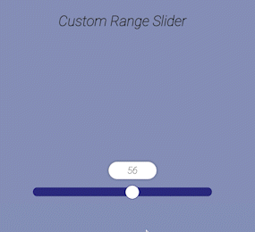

# About

This App is about the CSS Range that will be able to move in the right and left direction, corresponding with the position on the browser. That will be used logic on JavasCript to determine the range bullet position where it will be moved.

## Application Preview

